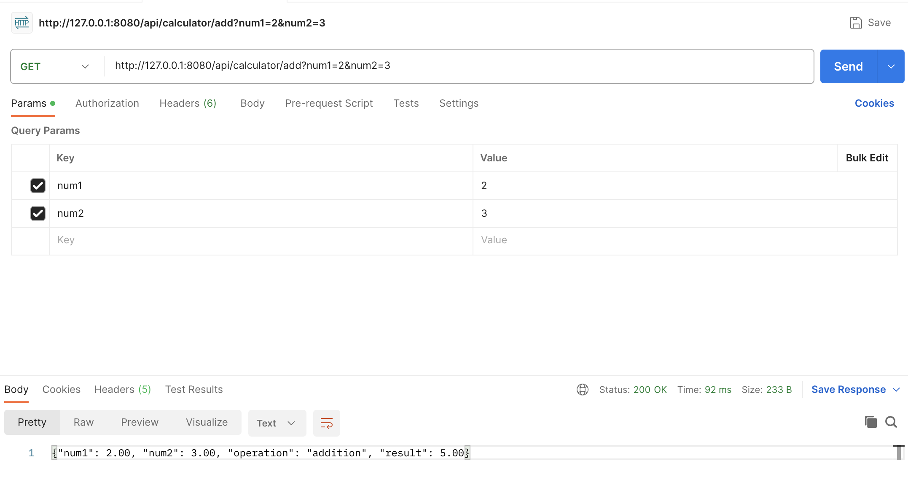

# Docker Lab

# Docker background

## Works on my machine problem

The "works on my machine" problem is a common issue in software development, particularly in environments that use containerization technologies like Docker. This problem arises when a developer builds and tests their application on their local machine, and everything works as expected. However, when the same application is deployed to a different environment, such as a staging or production server, it may encounter unexpected issues or fail to run correctly.

Docker aims to address this problem by providing a consistent and reproducible environment. Developers can package their applications and their dependencies into Docker containers, which encapsulate the entire runtime environment. This container can then be deployed across different machines, ensuring that the application runs consistently across various environments.

By using Docker, developers can minimize the "works on my machine" problem, as the containerized application is less dependent on the specific configuration of the host machine. It helps in creating a more reliable and portable development and deployment process.


## VM vs container architecture


## Docker 

Docker is a platform and set of tools designed to make it easier to create, deploy, and run applications in containers. Containers are lightweight, standalone, and executable software packages that include everything needed to run a piece of software, including the code, runtime, libraries, and system tools. Docker uses containerization technology to encapsulate applications and their dependencies, ensuring that they run consistently across different environments.

Key components and concepts of Docker include:

1. Docker Engine:

    The Docker Engine is the core component that enables the creation and execution of containers. It consists of a server daemon, a REST API, and a command-line interface (CLI) for interacting with Docker.

2. Docker Image:

    A Docker image is a lightweight, standalone, and executable package that includes the application code, runtime, libraries, and other dependencies. Images serve as the basis for containers.

3. Container:

    A Docker container is a runnable instance of a Docker image. It encapsulates the application and its dependencies in an isolated environment. Containers can be easily deployed and executed on any system that supports Docker.

4. Dockerfile:

    A Dockerfile is a text file that contains instructions for building a Docker image. It specifies the base image, adds application code and dependencies, and configures settings. Dockerfiles enable the automation of image creation.

5. Docker Hub:

    Docker Hub is a cloud-based registry that allows developers to share and distribute Docker images. It serves as a central repository for Docker images, and users can pull pre-built images from Docker Hub to use in their own environments.

6. Orchestration:

    Docker provides orchestration tools, such as Docker Compose and Kubernetes, to manage and scale containerized applications. Orchestration allows for the coordination of multiple containers and ensures that they work together seamlessly.


## Advantages of deploying application on Docker vs VM

Deploying applications on Docker and virtual machines (VMs) are both popular approaches, but they have key differences in terms of architecture and resource utilization:

1. Resource Efficiency:

    > Docker: Docker containers share the host OS kernel and isolate the application processes. This means they are more lightweight compared to VMs. Containers don't require a full operating system for each instance, resulting in faster startup times and lower resource overhead.

    > VMs: Virtual machines run complete guest operating systems, which can consume more resources. VMs have a higher overhead due to running separate kernels and operating systems for each instance.

2. Isolation:

    > Docker: Containers provide process-level isolation, separating the application processes from the host and other containers. However, they share the same OS kernel.

    > VMs: Virtual machines offer stronger isolation since each VM has its own complete OS, providing a higher level of security but at the cost of increased resource usage.

3. Portability:

    > Docker: Docker promotes portability, allowing developers to package their application and its dependencies into a container. This container can run consistently across different environments, ensuring that the application behaves the same way on any system.

    > VMs: VMs are less portable because they include an entire operating system. Moving a VM between different environments may require additional configuration and is generally not as straightforward as moving a Docker container.

4. Startup Time:

    > Docker: Containers generally have faster startup times since they share the host OS kernel and don't need to boot a complete operating system.

    > VMs: VMs may have longer startup times due to the need to boot a full operating system for each instance.

5. Density:

    > Docker: Docker allows for higher container density on a host machine since containers share the same OS kernel and have lower overhead.

    > VMs: VMs have higher resource overhead, which can limit the number of VMs that can run on a given host compared to containers.

In summary, Docker containers are lightweight, portable, and provide fast startup times, making them well-suited for microservices architectures and scalable deployments. VMs offer stronger isolation but come with higher resource overhead and longer startup times, making them more suitable for scenarios where strong isolation is a priority. The choice between Docker and VMs often depends on the specific requirements of the application and the desired balance between resource efficiency and isolation.


## Docker image Layers

In Docker, an image is composed of multiple layers. Each layer represents a set of file changes or instructions in the Dockerfile. These layers are combined to form a single, immutable image that contains the complete filesystem for a container. Understanding Docker image layers is crucial for optimizing image size, promoting reusability, and efficiently managing images.


1. Base Image Layer:

    The first layer is the base image layer, which serves as the foundation for the Docker image. It contains the underlying filesystem and OS. This layer is usually pulled from a registry like Docker Hub and is shared among multiple images.

2. Intermediate Layers:
   
    Each instruction in the Dockerfile adds a new layer to the image. For example, if you have an instruction to install a package, that action creates a new layer with the changes resulting from the package installation. These intermediate layers are stacked on top of the base image layer.

3. Immutable and Cached Layers:
   
   Docker images are designed to be immutable, meaning that once an image is built, its layers cannot be changed. If you make changes to an image, a new layer is added on top of the existing ones. This immutability is a key aspect of Docker's design and supports consistency and reproducibility.

4. Caching:

    Docker uses layer caching to speed up the build process. If a layer has not changed (based on the instruction in the Dockerfile and the context), Docker can reuse the cached layer instead of rebuilding it. This can significantly reduce build times.

5. Layer Reusability:

    Docker image layers are shared among different images when they have the same base image and intermediate layers. This sharing promotes reusability and saves storage space because layers are stored only once on the host system, even if used by multiple images.

Minimizing the number of layers, carefully ordering instructions in the Dockerfile, and using multi-stage builds are common practices to create smaller and more efficient images. Smaller images result in faster deployment times, reduced storage requirements, and improved overall performance.

## Multi stage Builds

A multi-stage Dockerfile is a feature in Docker that allows you to create more efficient and smaller Docker images by using multiple build stages within a single Dockerfile. This feature is particularly useful for optimizing the final production image by discarding unnecessary files and dependencies that were only needed during the build process. It helps reduce the size of the Docker image and improve security by minimizing the attack surface.

The basic idea of a multi-stage Dockerfile is to perform the build and compilation steps in one stage and copy only the necessary artifacts into the final production stage. This way, you can separate the development and build environment from the runtime environment.

```Dockerfile
# Build Stage
FROM some-build-image AS builder
WORKDIR /app
COPY . .
RUN npm install
RUN npm run build

# Production Stage
FROM some-runtime-image
WORKDIR /app
COPY --from=builder /app/dist /app/dist
CMD ["npm", "start"]
```

It's important to note that the `AS` keyword is used to assign a name to an intermediate image during the build stage, and the `--from=<stage>` flag is used in the `COPY` instruction to copy files from a specific stage into the final image


Benefits of using multi-stage builds include:

 - Smaller Images: The final production image only contains the necessary files, reducing the overall image size.
 - Improved Security: By excluding unnecessary tools and dependencies from the final image, you reduce the attack surface.
 - Separation of Concerns: The build stage is dedicated to building and compiling, while the production stage is focused on running the application.

## Docker compose
Docker Compose is a tool for defining and running multi-container Docker applications. It allows you to describe your application's services, networks, and volumes in a docker-compose.yml file, and then use that file to deploy and manage your application as a single unit.

Key features of Docker Compose include:

1. Service Definition:

    In a docker-compose.yml file, you define the services, networks, and volumes that make up your application. Each service represents a containerized application component.

2. Multi-Container Applications:

    Docker Compose is especially useful for applications that consist of multiple containers that need to work together. Instead of managing each container individually, you can define the entire application stack in one configuration file.

3. Easy Configuration:

    The docker-compose.yml file is written in YAML and provides a simple and human-readable way to describe the structure of your application. It includes details such as the base image, ports, environment variables, volumes, and dependencies between services.

4. Container Orchestration:

    Docker Compose simplifies container orchestration for development and testing environments. With a single command, you can start all the containers defined in your docker-compose.yml file, creating a cohesive environment.

5. Networking:

    Docker Compose automatically creates a default network that allows containers defined in the same docker-compose.yml file to communicate with each other using service names as hostnames.

6. Volumes:

    You can define volumes in the docker-compose.yml file to persist data between container restarts. This is useful for databases or any other service that needs to retain state.

7. Environment Variables:

    Docker Compose allows you to set environment variables for your services directly in the configuration file. This simplifies the configuration of applications that rely on environment-specific settings.

8. Scaling Services:

    You can scale services defined in the docker-compose.yml file by running a command like docker-compose up --scale service_name=3. This creates multiple instances of the specified service.

## How to use docker compose
1. Create a `docker-compose.yml` file in the root of your project.
2. Define your services, networks, and volumes in the file.
3. Run `docker-compose up` to start the defined services.
4. Optionally, use other `docker-compose` commands for managing containers, such as `docker-compose down` to stop and remove containers.

Docker Compose is particularly valuable for developers working on complex applications with multiple interconnected components, making it easier to manage and deploy the entire application stack consistently.

## Prerequisites

- [Docker Installation](https://github.com/SarathChandra24/MLOps-calculator-backend-spring/blob/main/DOCKER_BACKGROUND.md#docker-installation), If specific OS is not mentioned, please browse through [Official Docker](https://www.docker.com/get-started) documentation.

## Calculator application backend

This is a simple java springboot application which exposes calculator api.


## Running the Application with Docker

1. Clone this repository:
    ```bash
   git clone https://github.com/SarathChandra24/MLOps-calculator-backend-spring.git
   ```
2. Navigate to the project directory:
   ```bash
   cd MLOps-calculator-backend-spring
   ```
3. Build the docker image:
   ```bash
   docker build -t  calculator-backend:latest .
   ```
4. Run the Docker container:
   ```bash
   docker run -p 8080:8080 calculator-backend:latest
   ```
   This will start the Spring Boot application inside a Docker container, and it will be accessible at http://localhost:8080.

5. To stop the Docker container, press Ctrl+C in the terminal where the container is running, or run:
    ```bash
    docker ps
    docker container stop <container-id>
    ```
    You can get the container-id from > docker ps

## Test backend API

### Testing on Postman 


### Testing API on cURL
```bash
curl --location 'http://127.0.0.1:8080/api/calculator/add?num1=2&num2=3'
```

### Testing API using Python - Requests
```Python
import requests

url = "http://127.0.0.1:8080/api/calculator/add"

params = {'num1':2, 'num2':3}
headers = {}

response = requests.request("GET", url, headers=headers, params=payload)

print(response.text)
```

## Pushing the Image to container registry

### Docker Hub
1. Login to Docker Hub:

    Use the following command to log in to your Docker Hub account. Replace <username> with your Docker Hub username.

    ```bash
    docker login -u <username>
    ```
    You will be prompted to enter your Docker Hub password.

2. Tag the Docker Image:
    
    Before pushing the image, you need to tag it with your Docker Hub username and the repository name. Replace <username> with your Docker Hub username and <repository> with the name you want for your repository.

    ```bash
    docker tag your-docker-image-name:tag <username>/<repository>:tag
    ```

3. Push the Docker Image:
    Push the tagged image to Docker Hub:

    ```bash
    docker push <username>/<repository>:tag
    ```
This will push the Docker image to your Docker Hub repository. Now, your Docker image is available on Docker Hub under your specified repository.

Eg:
```bash
# Log in to Docker Hub
docker login -u sarathchandra24

# Tag the Docker image
docker tag calculator-backend:v1 sarathchandra24/calculator-backend:latest

# Push the Docker image
docker push sarathchandra24/calculator-backend:latest
```


## Running the front-end Application

1. Clone this repository:

   ```bash
   git clone https://github.com/SarathChandra24/MLOps-calculator-frontend.git
   ```
2. Navigate to the project directory:
    ```bash
    cd MLOps-calculator-frontend
    ```
3. Build the Docker images and start the containers:
    ```bash
    docker-compose up --build
    ```
    This command will build the Docker images and start the containers defined in the docker-compose.yml file.
4. The Spring Boot application will be accessible at http://localhost:8080.
5. The Python application can communicate with the Spring Boot application using the hostname spring-boot-app.
6. The front-end application will be accessible at http://localhost:45000.
7. To stop the containers, press Ctrl+C in the terminal where the containers are running, or run:
    ```bash
    docker-compose down
    ```

### Customization

```yaml
build:
      context: .
      dockerfile: Dockerfile
```

If you have a specific Dockerfile for your Python application, replace `context` in the `docker-compose.yml` file with the actual path to your Dockerfile.

```Yaml
ports:
    - "8080:8080"
```

```Yaml
ports:
    - "45000:5000"
```

Adjust the port mappings and networking configurations in the docker-compose.yml file based on your specific requirements.

Ensure that the port used by the Spring Boot application is not already in use on your machine.
